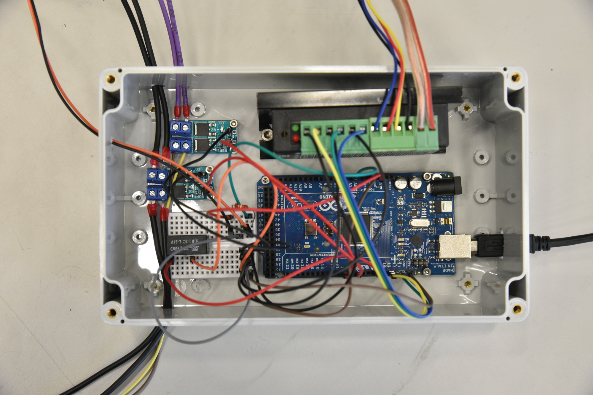
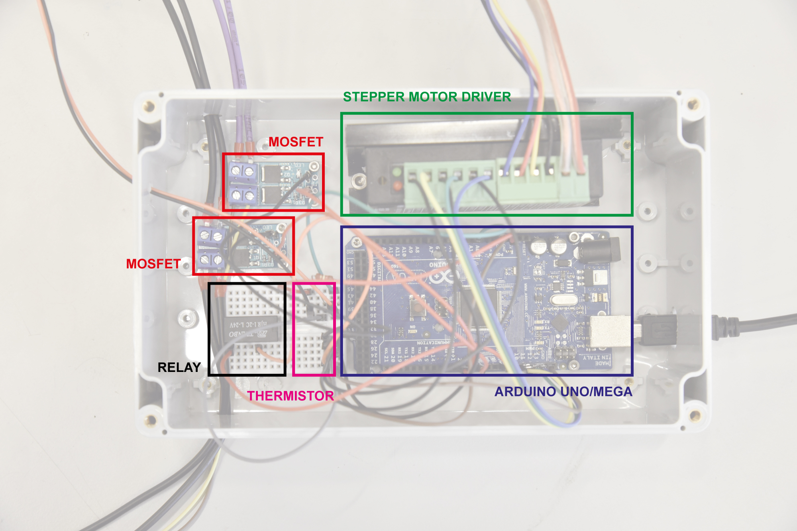
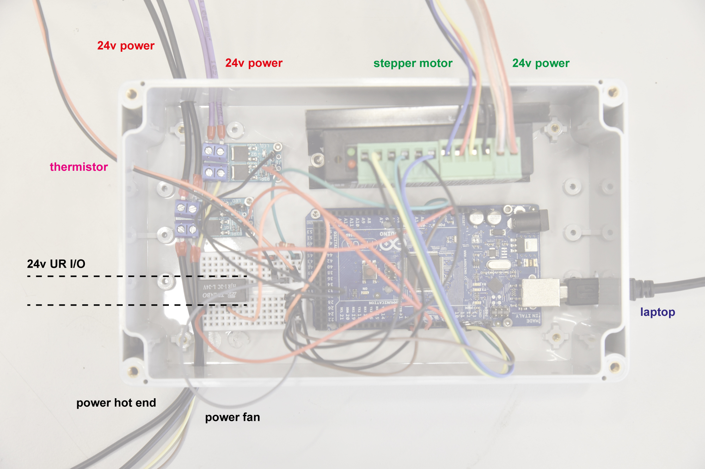

# Extruder assembly workshop

## What's in the box?

- E3D Titan Aero Extruder
- E3D SuperVolcano Hot End
- Nema 17 Stepper Motor
- Arduino UNO/MEGA
- TB6600 compatible Stepper Motor Driver
- 24V DC Power Supply
- 15A 400W MOSFET Driver 5-36V x2
- Bread board mini
- Relay 
- 100k Ohm resistor
- Jumper cables

## Required tools
- Hex screw driver
- Flathead screw driver
- Cross screw driver
- Drill
- (Potentiometer)

## Helpful tutorials
- Stepper motor with Arduino: https://www.makerguides.com/tb6600-stepper-motor-driver-arduino-tutorial/
- Build a heater with Arduino: https://www.alanzucconi.com/2016/08/02/arduino-heater-2/#introduction
- Basic arduino tutorials: https://www.arduino.cc/en/Tutorial/Foundations

## **IMPORTANT**
- Do not work with electronics when power is plugged in.
- Try to make good electrical connections, especially to the 24V power supply. Ask us for the crimping tool so we can make sure the connection is solid.

## Extruder assembly instructions

1. Assemble the Titan Aero Extruder according to the following instructions: https://e3d-online.dozuki.com/Guide/Titan+Aero+Assembly/23  
Start from *Step 14: Gather Titan Body* as we will be assembling the SuperVolcano nozzle in a second step.

    Notes:
    - In Step 15 do not use the M3 set screw that is supplied within the package, instead use one that we provide (ask us.)
    - In Step 32 it can be difficult to put in the screw with the washer. If it does not work, first try to slightly flatten the washer and try again. If it still does not work, leave the washer out but do not tighten the screw too tight as this can damage the bearings. 

1. Assemble the SuperVolcano heating block according to the following instructions: https://e3d-online.dozuki.com/Guide/Super+Volcano+Assembly/82

1. Connect cables to the fan and thermistor (using the sugarcubes), connect the supplied stepper motor cable and the heating cable using the Plug connection. Ask us for the rest of the required cables.

## Electronics box preparations

1. Place the components in the box according to the following picture. First place the electronics without fastening them to see what is the correct fit. After fitting all of the components, mark the holes on the bottom of the box with a pen and drill the holes with a 3mm drill. After drilling the holes you can put in the various components. Use M2.5 bolts and nuts for the electrical components and M4 bolts for the stepper driver.

1. Drill holes in the outside of the box for inputing cables. See the example for one possible way of doing it. 

1. Connect the four cables from the stepper motor to the stepper motor driver
    - Blue: B-
    - Red: B+
    - Yellow: A-
    - Black: A+

1. Connect the stepper driver outputs to the Arduino.
    - ENA - Arduino GND (on breadboard)
    - ENA + Arduino pin PWM 11
    - DIR - Arduino GND (on breadboard)
    - DIR + Arduino pin PWM 12
    - PUL - Arduino GND (on breadboard)
    - PUL + Arduino pin PWM 13

1. Put the stepper driver setting pins in the right position (800 microsteps / 1.5A): 
    1. ON
    1. OFF
    1. OFF
    1. ON
    1. ON
    1. OFF

1. Connect the MOSFET board which controls heating (note: MOSFET board needs to be soldered first, ask us before placing components)
    - TRIG/PWN > Arduino pin PWN5
    - GND > Arduino GND (on breadboard)
    - Vin + 24v power supply +
    - Vin - 24v power supply -
    - OUT + One end of heating element cable
    - OUT - Other end of heating element cable

1. Connect the MOSFET board which controls the fan (note: MOSFET board needs to be soldered first, ask us before placing components)
    - TRIG/PWN > Arduino pin PWM2
    - GND > Arduino GND (on breadboard)
    - Vin + 24v power supply +
    - Vin - 24v power supply -
    - OUT + One end of fan cable
    - OUT - Other end of fan cable

1. Read this guide on Arduino Thermistors: http://www.circuitbasics.com/arduino-thermistor-temperature-sensor-tutorial/  
    - Connect the output to the Arduino Analog In 0 (A0)

1. Connect the relay cabling according to the picture or example
    - Connect the robot I/O (Digital Output) to the relay.

1. Connect your laptop to the Arduino and upload the code which can be found in: *mini_eggshell\software\02_Arduino\plastic_extruder_arduino* 

1. Check the temperature using the Thermistor, turn the stepper motor on/off using the robot I/O and see if the fans are working. 

1. Profit!